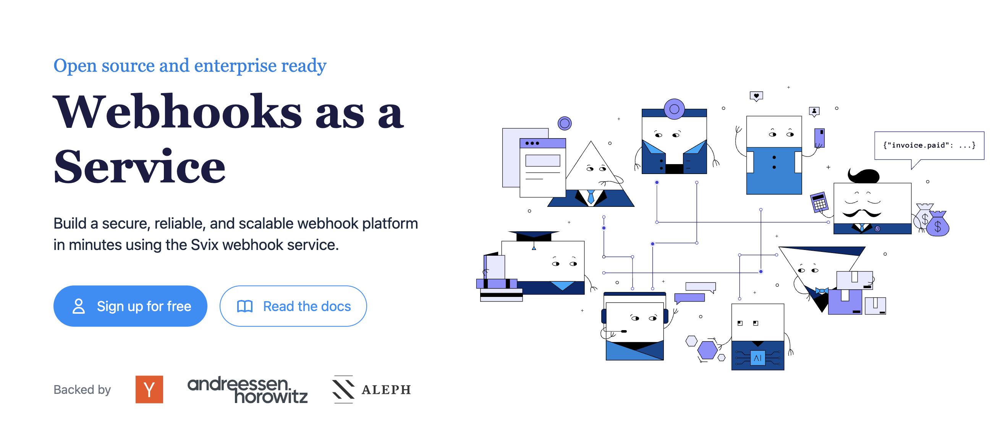

<div align="left">

[](https://svix.com)

# [Svix](https://svix.com)

Welcome to the Svix API documentation!

Useful links: [Homepage](https://www.svix.com) | [Support email](mailto:support+docs@svix.com) | [Blog](https://www.svix.com/blog/) | [Slack Community](https://www.svix.com/slack/)

# Introduction

This is the reference documentation and schemas for the [Svix webhook service](https://www.svix.com) API. For tutorials and other documentation please refer to [the documentation](https://docs.svix.com).

## Main concepts

In Svix you have four important entities you will be interacting with:

- `messages`: these are the webhooks being sent. They can have contents and a few other properties.
- `application`: this is where `messages` are sent to. Usually you want to create one application for each user on your platform.
- `endpoint`: endpoints are the URLs messages will be sent to. Each application can have multiple `endpoints` and each message sent to that application will be sent to all of them (unless they are not subscribed to the sent event type).
- `event-type`: event types are identifiers denoting the type of the message being sent. Event types are primarily used to decide which events are sent to which endpoint.


## Authentication

Get your authentication token (`AUTH_TOKEN`) from the [Svix dashboard](https://dashboard.svix.com) and use it as part of the `Authorization` header as such: `Authorization: Bearer ${AUTH_TOKEN}`. For more information on authentication, please refer to the [authentication token docs](https://docs.svix.com/api-keys).


## Code samples

The code samples assume you already have the respective libraries installed and you know how to use them. For the latest information on how to do that, please refer to [the documentation](https://docs.svix.com/).


## Idempotency

Svix supports [idempotency](https://en.wikipedia.org/wiki/Idempotence) for safely retrying requests without accidentally performing the same operation twice. This is useful when an API call is disrupted in transit and you do not receive a response.

To perform an idempotent request, pass the idempotency key in the `Idempotency-Key` header to the request. The idempotency key should be a unique value generated by the client. You can create the key in however way you like, though we suggest using UUID v4, or any other string with enough entropy to avoid collisions.

Svix's idempotency works by saving the resulting status code and body of the first request made for any given idempotency key for any successful request. Subsequent requests with the same key return the same result for a period of up to 12 hours.

Please note that idempotency is only supported for `POST` requests.


## Cross-Origin Resource Sharing

This API features Cross-Origin Resource Sharing (CORS) implemented in compliance with [W3C spec](https://www.w3.org/TR/cors/). And that allows cross-domain communication from the browser. All responses have a wildcard same-origin which makes them completely public and accessible to everyone, including any code on any site.


</div>

## Requirements

Building the API client library requires:

1. Java 1.8+
2. Maven (3.8.3+)/Gradle (7.2+)

If you are adding this library to an Android Application or Library:

3. Android 8.0+ (API Level 26+)

## Installation<a id="installation"></a>
<div align="center">
  <a href="https://konfigthis.com/sdk-sign-up?company=Svix&language=Java">
    
  </a>
</div>

### Maven users

Add this dependency to your project's POM:

```xml
<dependency>
  <groupId>com.konfigthis</groupId>
  <artifactId>svix-java-sdk</artifactId>
  <version>1.20.0</version>
  <scope>compile</scope>
</dependency>
```

### Gradle users

Add this dependency to your `build.gradle`:

```groovy
// build.gradle
repositories {
  mavenCentral()
}

dependencies {
   implementation "com.konfigthis:svix-java-sdk:1.20.0"
}
```

### Android users

Make sure your `build.gradle` file as a `minSdk` version of at least 26:
```groovy
// build.gradle
android {
    defaultConfig {
        minSdk 26
    }
}
```

Also make sure your library or application has internet permissions in your `AndroidManifest.xml`:

```xml
<!--AndroidManifest.xml-->
<?xml version="1.0" encoding="utf-8"?>
<manifest xmlns:android="http://schemas.android.com/apk/res/android"
    xmlns:tools="http://schemas.android.com/tools">
    <uses-permission android:name="android.permission.INTERNET"/>
</manifest>
```

### Others

At first generate the JAR by executing:

```shell
mvn clean package
```

Then manually install the following JARs:

* `target/svix-java-sdk-1.20.0.jar`
* `target/lib/*.jar`

## Getting Started

Please follow the [installation](#installation) instruction and execute the following Java code:

```java
import com.konfigthis.client.ApiClient;
import com.konfigthis.client.ApiException;
import com.konfigthis.client.ApiResponse;
import com.konfigthis.client.Svix;
import com.konfigthis.client.Configuration;
import com.konfigthis.client.auth.*;
import com.konfigthis.client.model.*;
import com.konfigthis.client.api.ApplicationApi;
import java.util.List;
import java.util.Map;
import java.util.UUID;

public class Example {
  public static void main(String[] args) {
    Configuration configuration = new Configuration();
    configuration.host = "https://api.eu.svix.com";
    
    // Configure HTTP bearer authorization: HTTPBearer
    configuration.token = "BEARER TOKEN";
    Svix client = new Svix(configuration);
    String name = "name_example";
    Integer rateLimit = 56;
    String uid = "uid_example"; // Optional unique identifier for the application
    Map<String, String> metadata = new HashMap();
    Boolean getIfExists = false; // Get an existing application, or create a new one if doesn't exist. It's two separate functions in the libs.
    String idempotencyKey = "idempotencyKey_example"; // The request's idempotency key
    try {
      ApplicationOut result = client
              .application
              .createNewApplication(name)
              .rateLimit(rateLimit)
              .uid(uid)
              .metadata(metadata)
              .getIfExists(getIfExists)
              .idempotencyKey(idempotencyKey)
              .execute();
      System.out.println(result);
      System.out.println(result.getUid());
      System.out.println(result.getName());
      System.out.println(result.getRateLimit());
      System.out.println(result.getId());
      System.out.println(result.getCreatedAt());
      System.out.println(result.getUpdatedAt());
      System.out.println(result.getMetadata());
    } catch (ApiException e) {
      System.err.println("Exception when calling ApplicationApi#createNewApplication");
      System.err.println("Status code: " + e.getStatusCode());
      System.err.println("Reason: " + e.getResponseBody());
      System.err.println("Response headers: " + e.getResponseHeaders());
      e.printStackTrace();
    }

    // Use .executeWithHttpInfo() to retrieve HTTP Status Code, Headers and Request
    try {
      ApiResponse<ApplicationOut> response = client
              .application
              .createNewApplication(name)
              .rateLimit(rateLimit)
              .uid(uid)
              .metadata(metadata)
              .getIfExists(getIfExists)
              .idempotencyKey(idempotencyKey)
              .executeWithHttpInfo();
      System.out.println(response.getResponseBody());
      System.out.println(response.getResponseHeaders());
      System.out.println(response.getStatusCode());
      System.out.println(response.getRoundTripTime());
      System.out.println(response.getRequest());
    } catch (ApiException e) {
      System.err.println("Exception when calling ApplicationApi#createNewApplication");
      System.err.println("Status code: " + e.getStatusCode());
      System.err.println("Reason: " + e.getResponseBody());
      System.err.println("Response headers: " + e.getResponseHeaders());
      e.printStackTrace();
    }
  }
}

```

## Documentation for API Endpoints

All URIs are relative to *https://api.eu.svix.com*

Class | Method | HTTP request | Description
------------ | ------------- | ------------- | -------------
*ApplicationApi* | [**createNewApplication**](docs/ApplicationApi.md#createNewApplication) | **POST** /api/v1/app | Create Application
*ApplicationApi* | [**getById**](docs/ApplicationApi.md#getById) | **GET** /api/v1/app/{app_id} | Get Application
*ApplicationApi* | [**listAll**](docs/ApplicationApi.md#listAll) | **GET** /api/v1/app | List Applications
*ApplicationApi* | [**partiallyUpdate**](docs/ApplicationApi.md#partiallyUpdate) | **PATCH** /api/v1/app/{app_id} | Patch Application
*ApplicationApi* | [**removeApp**](docs/ApplicationApi.md#removeApp) | **DELETE** /api/v1/app/{app_id} | Delete Application
*ApplicationApi* | [**updateApp**](docs/ApplicationApi.md#updateApp) | **PUT** /api/v1/app/{app_id} | Update Application
*AuthenticationApi* | [**expireAppTokens**](docs/AuthenticationApi.md#expireAppTokens) | **POST** /api/v1/auth/app/{app_id}/expire-all | Expire All
*AuthenticationApi* | [**generateMagicLink**](docs/AuthenticationApi.md#generateMagicLink) | **POST** /api/v1/auth/dashboard-access/{app_id} | Dashboard Access
*AuthenticationApi* | [**obtainMagicLinkAndCode**](docs/AuthenticationApi.md#obtainMagicLinkAndCode) | **POST** /api/v1/auth/app-portal-access/{app_id} | Get Consumer App Portal Access
*AuthenticationApi* | [**revokeToken**](docs/AuthenticationApi.md#revokeToken) | **POST** /api/v1/auth/logout | Logout
*BackgroundTasksApi* | [**getTaskById**](docs/BackgroundTasksApi.md#getTaskById) | **GET** /api/v1/background-task/{task_id} | Get Background Task
*BackgroundTasksApi* | [**listRecentTasks**](docs/BackgroundTasksApi.md#listRecentTasks) | **GET** /api/v1/background-task | List Background Tasks
*EndpointApi* | [**createNew**](docs/EndpointApi.md#createNew) | **POST** /api/v1/app/{app_id}/endpoint | Create Endpoint
*EndpointApi* | [**getEndpoint**](docs/EndpointApi.md#getEndpoint) | **GET** /api/v1/app/{app_id}/endpoint/{endpoint_id} | Get Endpoint
*EndpointApi* | [**getHeaders**](docs/EndpointApi.md#getHeaders) | **GET** /api/v1/app/{app_id}/endpoint/{endpoint_id}/headers | Get Endpoint Headers
*EndpointApi* | [**getSecret**](docs/EndpointApi.md#getSecret) | **GET** /api/v1/app/{app_id}/endpoint/{endpoint_id}/secret | Get Endpoint Secret
*EndpointApi* | [**getStats**](docs/EndpointApi.md#getStats) | **GET** /api/v1/app/{app_id}/endpoint/{endpoint_id}/stats | Endpoint Stats
*EndpointApi* | [**getTransformationCode**](docs/EndpointApi.md#getTransformationCode) | **GET** /api/v1/app/{app_id}/endpoint/{endpoint_id}/transformation | Get Endpoint Transformation
*EndpointApi* | [**listEndpoints**](docs/EndpointApi.md#listEndpoints) | **GET** /api/v1/app/{app_id}/endpoint | List Endpoints
*EndpointApi* | [**partiallySetHeaders**](docs/EndpointApi.md#partiallySetHeaders) | **PATCH** /api/v1/app/{app_id}/endpoint/{endpoint_id}/headers | Patch Endpoint Headers
*EndpointApi* | [**partiallyUpdate**](docs/EndpointApi.md#partiallyUpdate) | **PATCH** /api/v1/app/{app_id}/endpoint/{endpoint_id} | Patch Endpoint
*EndpointApi* | [**remove**](docs/EndpointApi.md#remove) | **DELETE** /api/v1/app/{app_id}/endpoint/{endpoint_id} | Delete Endpoint
*EndpointApi* | [**replayMissingWebhooks**](docs/EndpointApi.md#replayMissingWebhooks) | **POST** /api/v1/app/{app_id}/endpoint/{endpoint_id}/replay-missing | Replay Missing Webhooks
*EndpointApi* | [**resendFailedWebhooks**](docs/EndpointApi.md#resendFailedWebhooks) | **POST** /api/v1/app/{app_id}/endpoint/{endpoint_id}/recover | Recover Failed Webhooks
*EndpointApi* | [**rotateSecret**](docs/EndpointApi.md#rotateSecret) | **POST** /api/v1/app/{app_id}/endpoint/{endpoint_id}/secret/rotate | Rotate Endpoint Secret
*EndpointApi* | [**sendExampleMessage**](docs/EndpointApi.md#sendExampleMessage) | **POST** /api/v1/app/{app_id}/endpoint/{endpoint_id}/send-example | Send Event Type Example Message
*EndpointApi* | [**setTransformationCode**](docs/EndpointApi.md#setTransformationCode) | **PATCH** /api/v1/app/{app_id}/endpoint/{endpoint_id}/transformation | Set Endpoint Transformation
*EndpointApi* | [**updateEndpoint**](docs/EndpointApi.md#updateEndpoint) | **PUT** /api/v1/app/{app_id}/endpoint/{endpoint_id} | Update Endpoint
*EndpointApi* | [**updateHeaders**](docs/EndpointApi.md#updateHeaders) | **PUT** /api/v1/app/{app_id}/endpoint/{endpoint_id}/headers | Update Endpoint Headers
*EventTypeApi* | [**archiveType**](docs/EventTypeApi.md#archiveType) | **DELETE** /api/v1/event-type/{event_type_name} | Delete Event Type
*EventTypeApi* | [**createOrUpdate**](docs/EventTypeApi.md#createOrUpdate) | **POST** /api/v1/event-type | Create Event Type
*EventTypeApi* | [**getByName**](docs/EventTypeApi.md#getByName) | **GET** /api/v1/event-type/{event_type_name} | Get Event Type
*EventTypeApi* | [**getList**](docs/EventTypeApi.md#getList) | **GET** /api/v1/event-type | List Event Types
*EventTypeApi* | [**importFromOpenapi**](docs/EventTypeApi.md#importFromOpenapi) | **POST** /api/v1/event-type/import/openapi | Event Type Import From Openapi
*EventTypeApi* | [**partiallyUpdateType**](docs/EventTypeApi.md#partiallyUpdateType) | **PATCH** /api/v1/event-type/{event_type_name} | Patch Event Type
*EventTypeApi* | [**updateType**](docs/EventTypeApi.md#updateType) | **PUT** /api/v1/event-type/{event_type_name} | Update Event Type
*HealthApi* | [**checkServerStatus**](docs/HealthApi.md#checkServerStatus) | **GET** /api/v1/health | Health
*IntegrationApi* | [**createNewIntegration**](docs/IntegrationApi.md#createNewIntegration) | **POST** /api/v1/app/{app_id}/integration | Create Integration
*IntegrationApi* | [**deleteById**](docs/IntegrationApi.md#deleteById) | **DELETE** /api/v1/app/{app_id}/integration/{integ_id} | Delete Integration
*IntegrationApi* | [**getById**](docs/IntegrationApi.md#getById) | **GET** /api/v1/app/{app_id}/integration/{integ_id} | Get Integration
*IntegrationApi* | [**getKey**](docs/IntegrationApi.md#getKey) | **GET** /api/v1/app/{app_id}/integration/{integ_id}/key | Get Integration Key
*IntegrationApi* | [**listIntegrations**](docs/IntegrationApi.md#listIntegrations) | **GET** /api/v1/app/{app_id}/integration | List Integrations
*IntegrationApi* | [**rotateIntegrationKey**](docs/IntegrationApi.md#rotateIntegrationKey) | **POST** /api/v1/app/{app_id}/integration/{integ_id}/key/rotate | Rotate Integration Key
*IntegrationApi* | [**updateIntegration**](docs/IntegrationApi.md#updateIntegration) | **PUT** /api/v1/app/{app_id}/integration/{integ_id} | Update Integration
*MessageApi* | [**createNew**](docs/MessageApi.md#createNew) | **POST** /api/v1/app/{app_id}/msg | Create Message
*MessageApi* | [**deletePayload**](docs/MessageApi.md#deletePayload) | **DELETE** /api/v1/app/{app_id}/msg/{msg_id}/content | Delete message payload
*MessageApi* | [**getByIdOrEventId**](docs/MessageApi.md#getByIdOrEventId) | **GET** /api/v1/app/{app_id}/msg/{msg_id} | Get Message
*MessageApi* | [**listAllMessages**](docs/MessageApi.md#listAllMessages) | **GET** /api/v1/app/{app_id}/msg | List Messages
*MessageAttemptApi* | [**deleteResponseBody**](docs/MessageAttemptApi.md#deleteResponseBody) | **DELETE** /api/v1/app/{app_id}/msg/{msg_id}/attempt/{attempt_id}/content | Delete attempt response body
*MessageAttemptApi* | [**getByDestination**](docs/MessageAttemptApi.md#getByDestination) | **GET** /api/v1/app/{app_id}/msg/{msg_id}/attempt/{attempt_id} | Get Attempt
*MessageAttemptApi* | [**listAttemptedDestinations**](docs/MessageAttemptApi.md#listAttemptedDestinations) | **GET** /api/v1/app/{app_id}/msg/{msg_id}/endpoint | List Attempted Destinations
*MessageAttemptApi* | [**listAttemptedMessages**](docs/MessageAttemptApi.md#listAttemptedMessages) | **GET** /api/v1/app/{app_id}/endpoint/{endpoint_id}/msg | List Attempted Messages
*MessageAttemptApi* | [**listByEndpoint**](docs/MessageAttemptApi.md#listByEndpoint) | **GET** /api/v1/app/{app_id}/attempt/endpoint/{endpoint_id} | List Attempts By Endpoint
*MessageAttemptApi* | [**listByEndpointDeprecated**](docs/MessageAttemptApi.md#listByEndpointDeprecated) | **GET** /api/v1/app/{app_id}/msg/{msg_id}/endpoint/{endpoint_id}/attempt | List Attempts For Endpoint
*MessageAttemptApi* | [**listByMsgAttemptedDestinations**](docs/MessageAttemptApi.md#listByMsgAttemptedDestinations) | **GET** /api/v1/app/{app_id}/attempt/msg/{msg_id} | List Attempts By Msg
*MessageAttemptApi* | [**listByMsgAttemptedDestinations_0**](docs/MessageAttemptApi.md#listByMsgAttemptedDestinations_0) | **GET** /api/v1/app/{app_id}/msg/{msg_id}/attempt | List Attempts
*MessageAttemptApi* | [**resendMessageToEndpoint**](docs/MessageAttemptApi.md#resendMessageToEndpoint) | **POST** /api/v1/app/{app_id}/msg/{msg_id}/endpoint/{endpoint_id}/resend | Resend Webhook
*StatisticsApi* | [**calculateEventTypesForAllApps**](docs/StatisticsApi.md#calculateEventTypesForAllApps) | **PUT** /api/v1/stats/usage/event-types | Aggregate Event Types
*StatisticsApi* | [**calculateMessageDestinations**](docs/StatisticsApi.md#calculateMessageDestinations) | **POST** /api/v1/stats/usage/app | Aggregate App Stats


## Documentation for Models

 - [AggregateEventTypesOut](docs/AggregateEventTypesOut.md)
 - [AppPortalAccessIn](docs/AppPortalAccessIn.md)
 - [AppPortalAccessOut](docs/AppPortalAccessOut.md)
 - [AppUsageStatsIn](docs/AppUsageStatsIn.md)
 - [AppUsageStatsOut](docs/AppUsageStatsOut.md)
 - [ApplicationIn](docs/ApplicationIn.md)
 - [ApplicationOut](docs/ApplicationOut.md)
 - [ApplicationPatch](docs/ApplicationPatch.md)
 - [ApplicationTokenExpireIn](docs/ApplicationTokenExpireIn.md)
 - [BackgroundTaskOut](docs/BackgroundTaskOut.md)
 - [BackgroundTaskStatus](docs/BackgroundTaskStatus.md)
 - [BackgroundTaskType](docs/BackgroundTaskType.md)
 - [BorderRadiusConfig](docs/BorderRadiusConfig.md)
 - [BorderRadiusEnum](docs/BorderRadiusEnum.md)
 - [CompletionChoice](docs/CompletionChoice.md)
 - [CompletionMessage](docs/CompletionMessage.md)
 - [CustomColorPalette](docs/CustomColorPalette.md)
 - [CustomThemeOverride](docs/CustomThemeOverride.md)
 - [DashboardAccessOut](docs/DashboardAccessOut.md)
 - [Duration](docs/Duration.md)
 - [EndpointCreatedEvent](docs/EndpointCreatedEvent.md)
 - [EndpointCreatedEventData](docs/EndpointCreatedEventData.md)
 - [EndpointDeletedEvent](docs/EndpointDeletedEvent.md)
 - [EndpointDeletedEventData](docs/EndpointDeletedEventData.md)
 - [EndpointDisabledEvent](docs/EndpointDisabledEvent.md)
 - [EndpointDisabledEventData](docs/EndpointDisabledEventData.md)
 - [EndpointHeadersIn](docs/EndpointHeadersIn.md)
 - [EndpointHeadersOut](docs/EndpointHeadersOut.md)
 - [EndpointHeadersPatchIn](docs/EndpointHeadersPatchIn.md)
 - [EndpointIn](docs/EndpointIn.md)
 - [EndpointMessageOut](docs/EndpointMessageOut.md)
 - [EndpointOut](docs/EndpointOut.md)
 - [EndpointPatch](docs/EndpointPatch.md)
 - [EndpointSecretOut](docs/EndpointSecretOut.md)
 - [EndpointSecretRotateIn](docs/EndpointSecretRotateIn.md)
 - [EndpointStats](docs/EndpointStats.md)
 - [EndpointTransformationIn](docs/EndpointTransformationIn.md)
 - [EndpointTransformationOut](docs/EndpointTransformationOut.md)
 - [EndpointTransformationSimulateIn](docs/EndpointTransformationSimulateIn.md)
 - [EndpointTransformationSimulateOut](docs/EndpointTransformationSimulateOut.md)
 - [EndpointUpdate](docs/EndpointUpdate.md)
 - [EndpointUpdatedEvent](docs/EndpointUpdatedEvent.md)
 - [EndpointUpdatedEventData](docs/EndpointUpdatedEventData.md)
 - [EnvironmentIn](docs/EnvironmentIn.md)
 - [EnvironmentOut](docs/EnvironmentOut.md)
 - [EnvironmentSettingsOut](docs/EnvironmentSettingsOut.md)
 - [EventExampleIn](docs/EventExampleIn.md)
 - [EventTypeImportOpenApiIn](docs/EventTypeImportOpenApiIn.md)
 - [EventTypeImportOpenApiOut](docs/EventTypeImportOpenApiOut.md)
 - [EventTypeImportOpenApiOutData](docs/EventTypeImportOpenApiOutData.md)
 - [EventTypeIn](docs/EventTypeIn.md)
 - [EventTypeOut](docs/EventTypeOut.md)
 - [EventTypePatch](docs/EventTypePatch.md)
 - [EventTypeUpdate](docs/EventTypeUpdate.md)
 - [ExportEventTypeOut](docs/ExportEventTypeOut.md)
 - [FontSizeConfig](docs/FontSizeConfig.md)
 - [GenerateIn](docs/GenerateIn.md)
 - [GenerateOut](docs/GenerateOut.md)
 - [InboundPathParams](docs/InboundPathParams.md)
 - [IntegrationIn](docs/IntegrationIn.md)
 - [IntegrationKeyOut](docs/IntegrationKeyOut.md)
 - [IntegrationOut](docs/IntegrationOut.md)
 - [IntegrationUpdate](docs/IntegrationUpdate.md)
 - [ListResponseApplicationOut](docs/ListResponseApplicationOut.md)
 - [ListResponseBackgroundTaskOut](docs/ListResponseBackgroundTaskOut.md)
 - [ListResponseEndpointMessageOut](docs/ListResponseEndpointMessageOut.md)
 - [ListResponseEndpointOut](docs/ListResponseEndpointOut.md)
 - [ListResponseEventTypeOut](docs/ListResponseEventTypeOut.md)
 - [ListResponseIntegrationOut](docs/ListResponseIntegrationOut.md)
 - [ListResponseMessageAttemptEndpointOut](docs/ListResponseMessageAttemptEndpointOut.md)
 - [ListResponseMessageAttemptOut](docs/ListResponseMessageAttemptOut.md)
 - [ListResponseMessageEndpointOut](docs/ListResponseMessageEndpointOut.md)
 - [ListResponseMessageOut](docs/ListResponseMessageOut.md)
 - [ListResponseTemplateOut](docs/ListResponseTemplateOut.md)
 - [MessageAttemptEndpointOut](docs/MessageAttemptEndpointOut.md)
 - [MessageAttemptExhaustedEvent](docs/MessageAttemptExhaustedEvent.md)
 - [MessageAttemptExhaustedEventData](docs/MessageAttemptExhaustedEventData.md)
 - [MessageAttemptFailedData](docs/MessageAttemptFailedData.md)
 - [MessageAttemptFailingEvent](docs/MessageAttemptFailingEvent.md)
 - [MessageAttemptFailingEventData](docs/MessageAttemptFailingEventData.md)
 - [MessageAttemptHeadersOut](docs/MessageAttemptHeadersOut.md)
 - [MessageAttemptOut](docs/MessageAttemptOut.md)
 - [MessageAttemptRecoveredEvent](docs/MessageAttemptRecoveredEvent.md)
 - [MessageAttemptRecoveredEventData](docs/MessageAttemptRecoveredEventData.md)
 - [MessageAttemptTriggerType](docs/MessageAttemptTriggerType.md)
 - [MessageBroadcastIn](docs/MessageBroadcastIn.md)
 - [MessageBroadcastOut](docs/MessageBroadcastOut.md)
 - [MessageEndpointOut](docs/MessageEndpointOut.md)
 - [MessageIn](docs/MessageIn.md)
 - [MessageOut](docs/MessageOut.md)
 - [MessageRawPayloadOut](docs/MessageRawPayloadOut.md)
 - [MessageStatus](docs/MessageStatus.md)
 - [MessageStreamOut](docs/MessageStreamOut.md)
 - [OauthPayloadIn](docs/OauthPayloadIn.md)
 - [OauthPayloadOut](docs/OauthPayloadOut.md)
 - [OneTimeTokenIn](docs/OneTimeTokenIn.md)
 - [OneTimeTokenOut](docs/OneTimeTokenOut.md)
 - [Ordering](docs/Ordering.md)
 - [RecoverIn](docs/RecoverIn.md)
 - [RecoverOut](docs/RecoverOut.md)
 - [ReplayIn](docs/ReplayIn.md)
 - [ReplayOut](docs/ReplayOut.md)
 - [RetryScheduleInOut](docs/RetryScheduleInOut.md)
 - [RotatedUrlOut](docs/RotatedUrlOut.md)
 - [SettingsIn](docs/SettingsIn.md)
 - [SettingsOut](docs/SettingsOut.md)
 - [StatusCodeClass](docs/StatusCodeClass.md)
 - [TemplateIn](docs/TemplateIn.md)
 - [TemplateOut](docs/TemplateOut.md)
 - [TemplatePatch](docs/TemplatePatch.md)
 - [TemplateUpdate](docs/TemplateUpdate.md)
 - [TransformationHttpMethod](docs/TransformationHttpMethod.md)
 - [TransformationSimulateIn](docs/TransformationSimulateIn.md)
 - [TransformationSimulateOut](docs/TransformationSimulateOut.md)
 - [TransformationTemplateKind](docs/TransformationTemplateKind.md)
 - [ValidationError](docs/ValidationError.md)


## Author
This Java package is automatically generated by [Konfig](https://konfigthis.com)
